#  操作系统的访问控制设计实例研究

### 实验目的

- 以 iOS 和 Android 系统为研究对象，对操作系统的访问控制进行研究。

### 实验环境

- Android环境：
  - 操作系统：Harmony OS 2.0.0
  - 硬件版本：HuaWei nova 7 pro
  - 默认设置
- iOS环境：
  - 操作系统：iOS 12.5.6
  - 硬件版本：iPad Air 
  - 默认设置

### 实验过程

- 以 iOS 和 Android 系统为研究对象

  - 当系统处于锁屏状态下接收到新短信时，不解锁情况下

    - 系统是否允许查看短信内容？

      - Android

        允许查看

        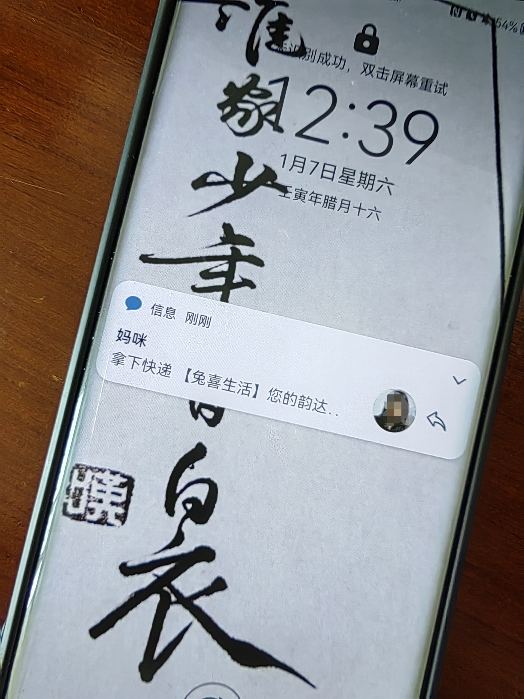

        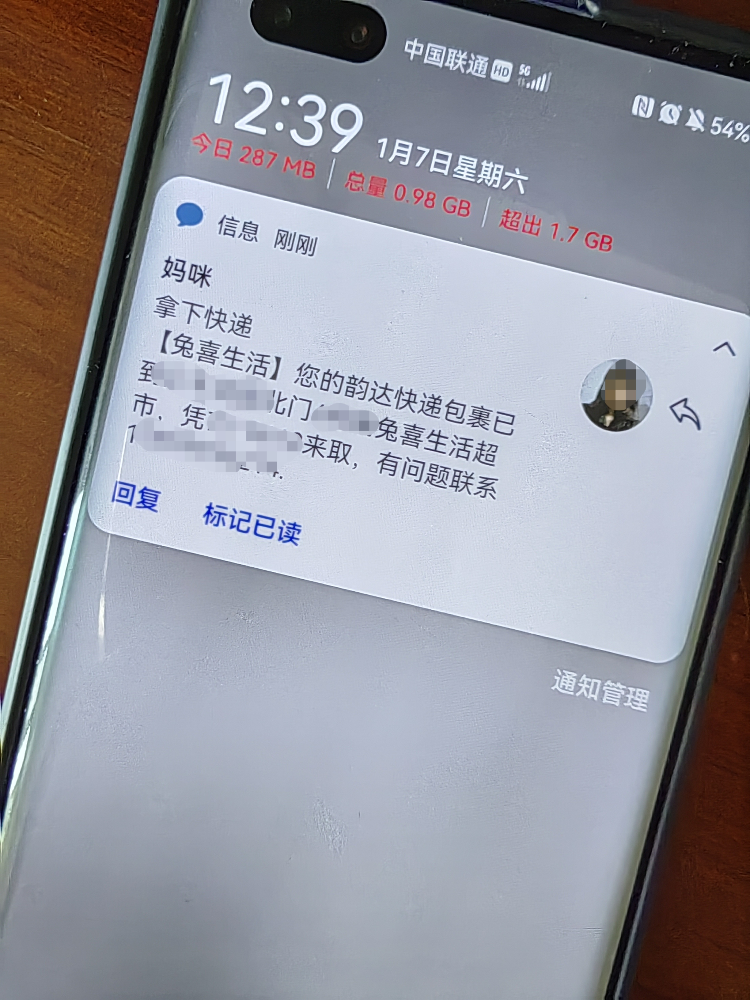

      - iOS

        允许查看

        

    - 系统是否允许回复短信？

      - Android

        不允许回复，需要解锁

        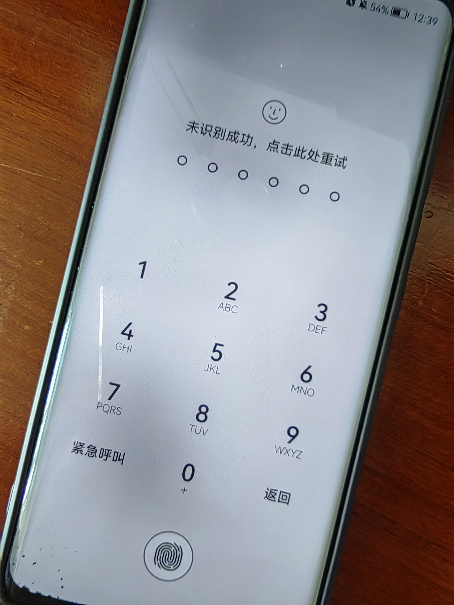

      - iOS

        不允许回复,需要解锁

        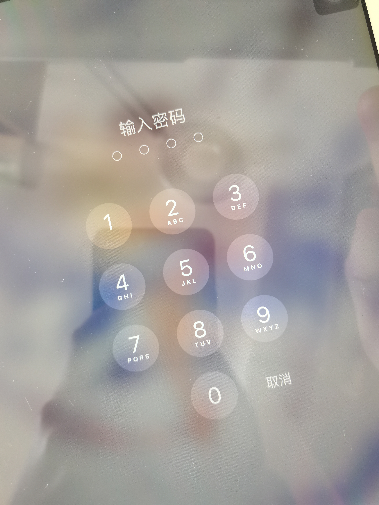

    - 安卓上的 App : 以 ***微信电话本\*** 为例，在接管了系统短信功能和权限之后，是否会有一些不同的功能设定？

      - 使用系统默认设置的话,还是仅可阅读,回复需要解锁
      - 在微信中可设置消息不展示,即锁屏时仅通知有几条新消息,不显示消息内容

  - 当系统处于锁屏状态下，使用系统内置（例如 iOS 的 Siri ）或第三方的语音助手可以完成以下哪些操作？

    - 访问通讯录

      - Android

        不允许，需要解锁

        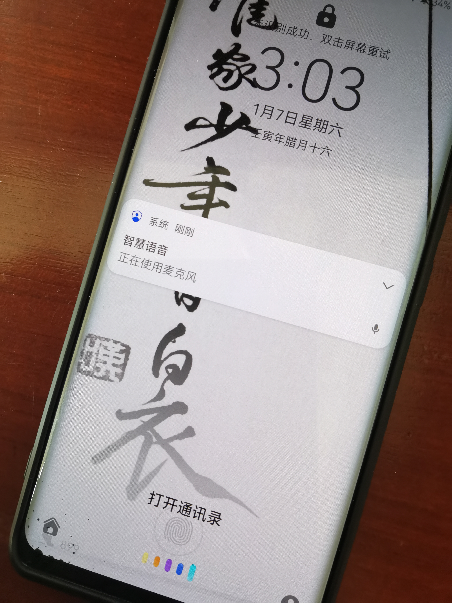

        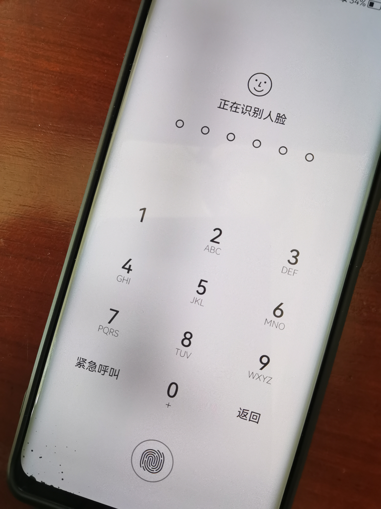

      - iOS

        不允许，需要解锁

        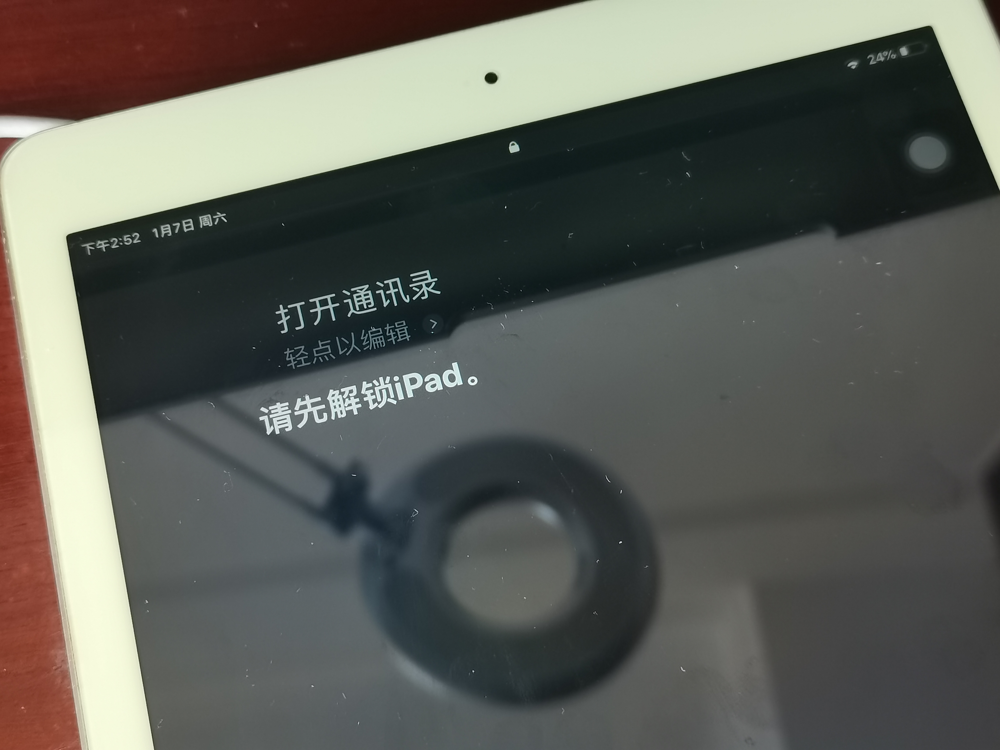

    - 拨打电话

      - Android

        可以拨打

        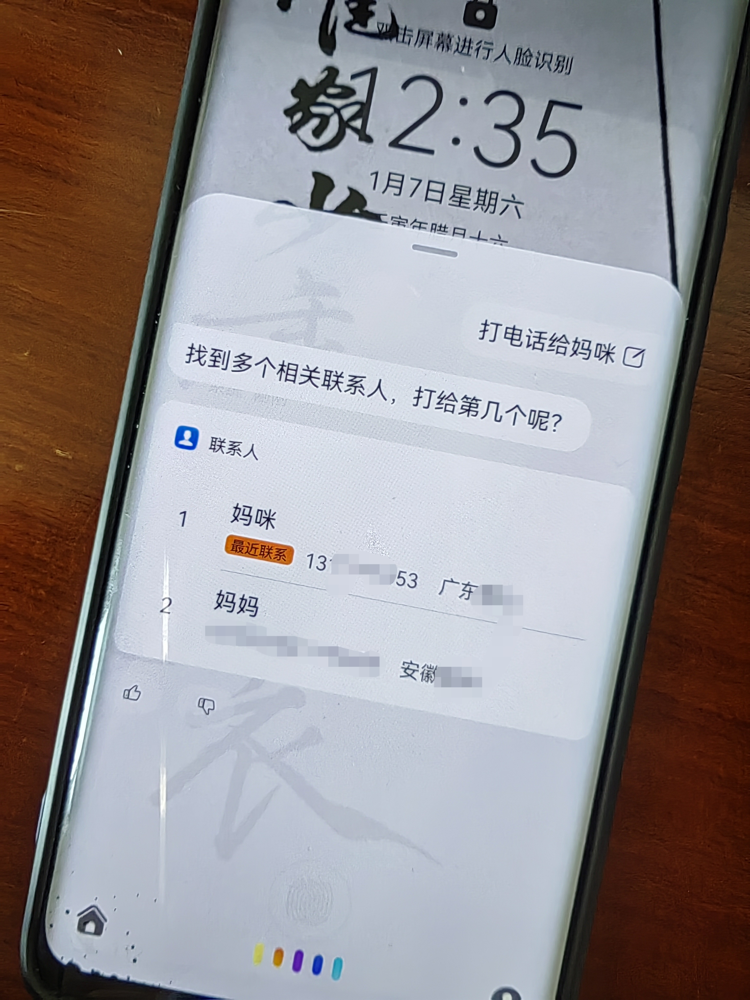

        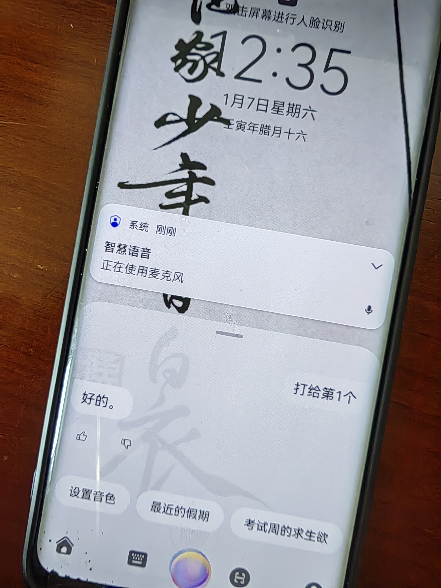

        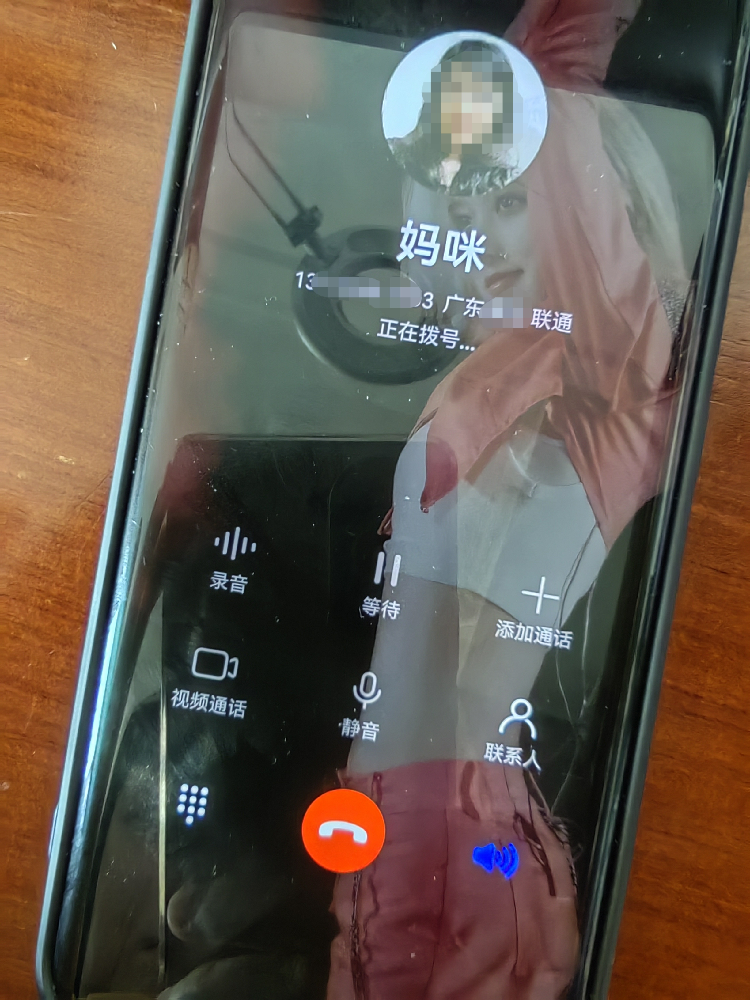

      - iOS

        可以拨打

        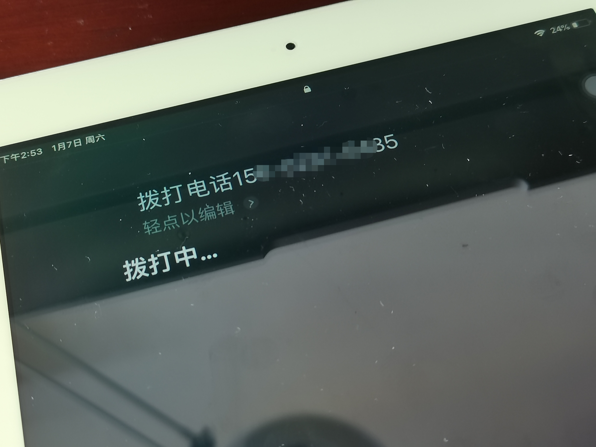

    - 访问相册

      - Android

        不允许，需要解锁

        .jpg)

        .jpg)

      - iOS

        不允许，需要解锁

        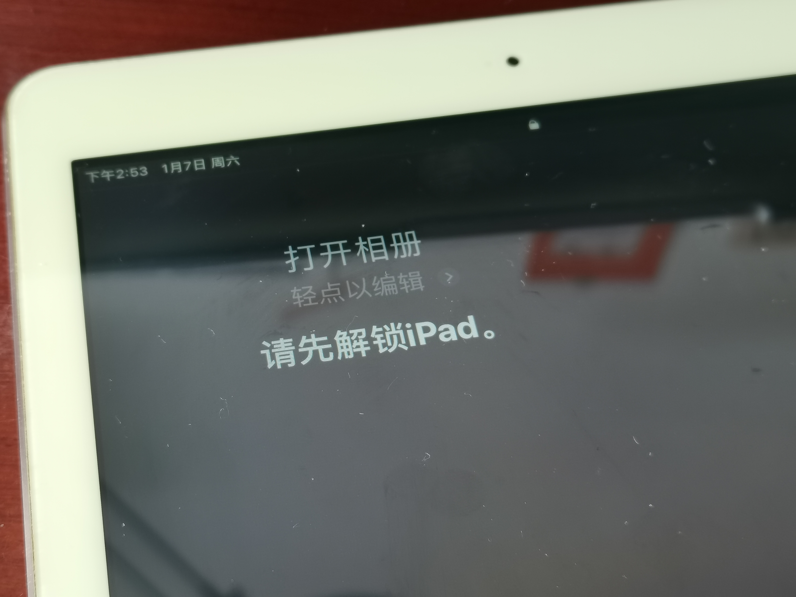

    - 查看短信收件箱

      - Android

        不允许，需要解锁

        .jpg)

        .jpg)

      - iOS

        不允许，需要解锁

        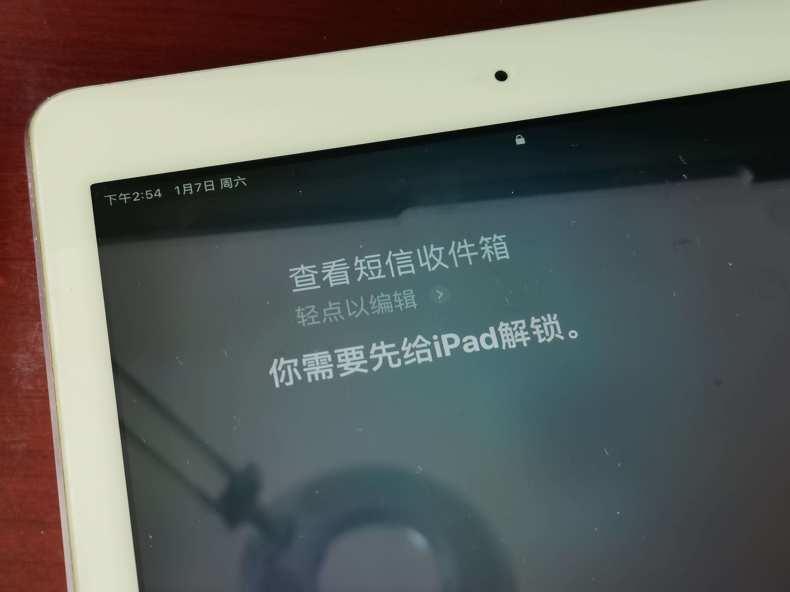

  - 如果你的手机支持指纹识别解锁手机，请实验并分析指纹识别相比较于简单密码、复杂密码、图形解锁、人脸识别解锁、声纹解锁等解锁方式的安全性、便利性差异。

    - **简单密码:**

      安全性低, 容易被破解

      便利性一般, 输入密码不太方便

    - **复杂密码:**

      安全性一般

      便利性:记忆困难,需要输入密码,不方便

    - **图形解锁:**

      安全性低, 容易被破解

      便利性:需要画图不太方便

    - **人脸识别:**

      安全性较高

      便利性: 很方便, 手机能够主动识别

    - **声纹解锁:**

      安全性: 一般情况下安全性较高,但容易被伪造

      便利性: 很方便,但需要保持安静环境下除外

    - **指纹解锁:**

      安全性高

      便利性: 很方便,但若手上有水或者手指状态不好可能难以识别。

### 思考题

- 以上设计实现方式属于我们课堂上讲过的哪种强制访问控制模型？Lattice/BLP？Biba？

  - Biba模型，可以上读下写。

- 系统或第三方应用程序是否提供了上述功能的访问控制规则修改？如果修改默认配置，是提高了安全性还是降低了安全性？

  - 提供了访问控制规则修改。

  - 如果是将消息设置为不可见的话,提高了安全性;

    但如果是改成无需解锁就可回复或访问的话,降低了安全性。

##  课后题

1. 生物特征身份认证方式有哪些？优缺点分析？应用场景举例。

   - **指纹识别**

     - 优点:

       1、使用方便，识别率高，识别速度快。

       2、 指纹图案是独特的，所以稳定性和可靠性高。

       3、指纹损坏后可以恢复，所以很可靠，不会造成数据丢失。

       4、指纹采集头可以更加小型化，并且价格会更加低廉。

     - 缺点:

       1、采集指纹的过程很繁琐，需要多次进行。

       2、有缺点，因为不能排除有人出生时没有指纹。

       3、手指的生长或指纹的缺陷在短期内不能正确识别。

       4、指纹可以被复制或掩盖，这大大降低了安全性。

     - 应用场景:

       刑侦、指纹门禁银行、指纹密码储蓄、指纹密码登录，各类智能信用卡的防伪，自动提款机ATM的身份确认，银行保管箱业务的客户身份确认,计算机网络系统及终端的授权使用，股票交易系统中的身份确认；血液中心及医疗卫生系统身份确认及无须钥匙的指纹锁等.

   - **人脸识别**

     - 优点:

       1、不需要刻意保持表情，可以在自然状态下进行。

       2、没有接触，方便卫生，减少了疾病传播的风险。

       3、支持同时检测多人的面部特征。

     - 缺点:

       1、化妆或整容后可能无法辨认，也可能伪装成他人，降低安全性。

       2、人可能通过照片或视频记录伪装成另一个人的脸，造成虚假匹配，降低安全性。

       3、当人脸收集和处理的数据大于指纹数据时，其速度就不如指纹识别快。

     - 应用场景:自动进行出入，登记人员、车辆归档，公司的考勤系统，铁路安防系统、机关、移动警务和某些特定的场合的身份识别

   - **虹膜识别**

     - 优点:

       1、特殊特征，不可修改、不能复制，安全性高。

       2、没有接触，安全卫生，可避免疾病感染。

     - 缺点:

       1、虹膜识别的硬件成本大，与其他识别相比无法做到快速大规模推广。

       2、识别不方便，目前技术下识别的准确性较低，识别速度也比较低。

     - 应用场景:信息安全，矿山人员安全管理，建筑行业实名制认证，教育考试,司法安检，银行金融，门禁考勤等

   - **掌纹识别**

     - 优点:

       1、操作简单，准确度高。

       2、检测延迟时间短，效率高。

       3、与指纹识别相比，小面积的污垢或疤痕并不影响手形识别。

     - 缺点:

       1、人类手掌的相似度较高,唯一性不强

       2、手掌与设备接触,不卫生

     - 应用场景:

       身份验证与身份识别等领域，如考勤系统、人员出入管理方面的应用、公共安全方面的应用(如门禁系统)、银行及信用卡方面的应用、电子商务中的个人身份鉴别、户籍、身份证管理方面的应用、对机密信息的存取控制(包括计算机网络中的信息访问控制)等。

   - **声纹识别**

     - 优点:

       1、容易获取，操作方便，接收硬件成本低。

       2、可以远程确认身份

       3、与其他生物识别方法相比，算法复杂度低。

     - 缺点:

       1、容易因身体状况、年龄、情绪和其他导致识别障碍。

       2、对环境噪声干扰敏感。

       3、麦克风参数也会影响识别效果。

     - 应用场景:

       刑侦领域:重点人员，布控侦查破案，反电信诈骗，治安防控，身份认证。

       金融领域： 登录、支付场景，业务核身，信贷完成信审身份审核，金融反洗钱，远程身份认证。

2. “找回口令功能”和“忘记密码”在访问授权机制中的意义？请尝试设计几种安全的“找回口令功能”，详细描述找回口令的用户具体操作过程。

   - 找回口令和忘记密码是同一个功能
   - 意义:防止用户因遗忘密码等问题造成损失,验证用户真实身份,授权给正确的用户。
   - 忘记密码->输入用户名/账号/绑定的手机号/邮箱->发送验证码->填写验证码进行身份验证->重置密码

3. 绘制用户使用用户名/口令+图片验证码方式登录系统的流程图。考虑认证成功和失败两种场景，考虑授权成功和失败两种场景。

   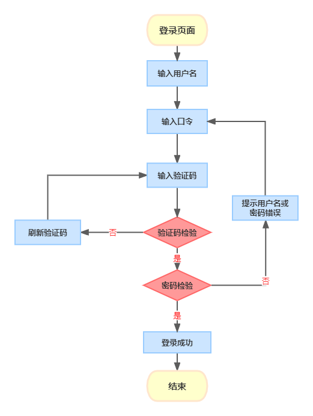

4. Windows XP / 7 中的访问控制策略有哪些？访问控制机制有哪些？

   - 自主访问控制
   - 强制访问控制
   - 基于角色的访问控制

5. 用权限三角形模型来理解并描述下 2 种威胁模型：提权、仿冒。

   - 提权:用户->角色->权限

     用户角色不变,以自己的身份获得了更多原本没有的权限

   - 仿冒:用户->角色

     角色发生改变,以冒充其他角色的方式获得了其他角色拥有的权限.

6. 试通过操作系统的访问控制机制来达到预防一种真实病毒的运行目的。

   - 获取操作系统内应用程序的信息；为应用程序配置信任级别；按照信任级别对应用程序的可执行文件进行权限控制。即使有携带病毒的可执行文件进入系统，由于没有执行权限，也不会对操作系统造成感染和破坏，保证操作系统的安全。

7. 什么是 OAuth？

   - 全称 Open Authorization 开放授权；是一种基于令牌的身份验证，允许组织跨第三方服务共享信息，而无需公开用户的用户名/密码。本质上，OAuth是为第三方服务提供令牌的中间人，该令牌只允许共享特定的帐户信息。
   - OAuth是一个开放的标准，它提供了一个简单和标准化的安全授权方法，允许用户让第三方应用程序访问网站上关于用户的某些信息（例如，简单的个人信息），而无需向第三方应用程序提供用户的姓名和密码。

8. 什么是 OpenID？

   - OpenID 是一个以用户为中心的数字身份识别框架，它具有开放、分散性。
   - 在支持OpenID的网站上，用户不需要记住传统的认证凭证，如用户名和密码。他们只需要预先在一个作为OpenID身份提供者的网站上注册。OpenID是去中心化的，任何网站都可以使用OpenID作为用户登录的手段，任何网站都可以作为OpenID身份提供者。OpenID既解决了问题而又不需要依赖于中心性的网站来确认数字身份。

9. 试用本章所学理论分析OAuth 和 OpenID 的区别与联系。

   - OAuth关注的是授权，即：“用户能做什么”；而OpenID关注的是证明，即：“用户是谁”。

10. 如何使用 OAuth 和 OpenID 相关技术实现单点登录（Single Sign On）？

    - 客户端向从资源所有者请求授权。授权请求可以直接向资源所有者发起（如图所示），或者更可取的是通过作为中介的授权服务器间接发起。

    - 客户端收到授权许可，这是一个代表资源所有者的授权的凭据，使用本规范中定义的四种许可类型之一或 者使用扩展许可类型表示。授权许可类型取决于客户端请求授权所使用的方式以及授权服务器支持的类型。

    - 客户端与授权服务器进行身份认证并出示授权许可请求访问令牌。

    - 授权服务器验证客户端身份并验证授权许可，若有效则颁发访问令牌。

    - 客户端从资源服务器请求受保护资源并出示访问令牌进行身份验证。

    - 资源服务器验证访问令牌，若有效则满足该请求。

      