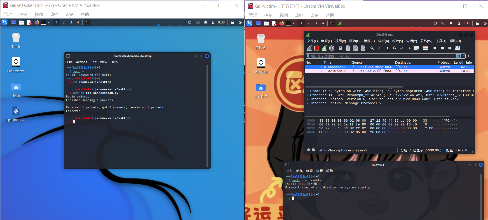
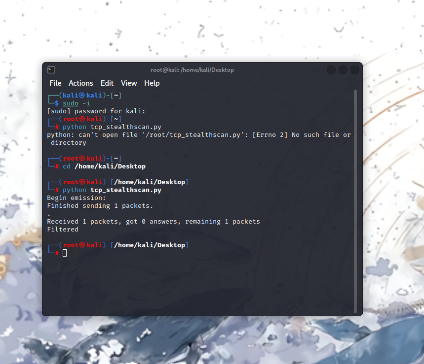
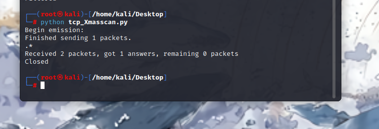
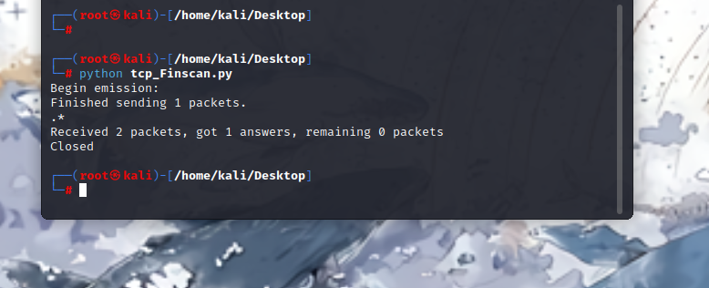
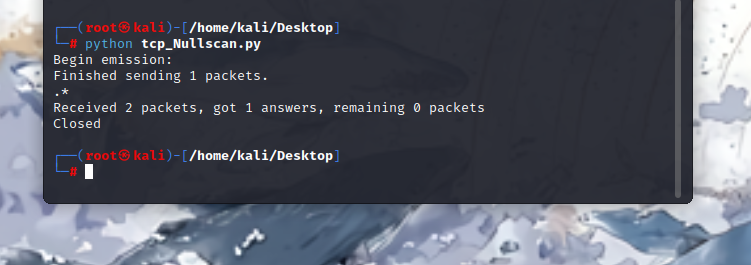

# 基于 Scapy 编写端口扫描器

## 实验目的

- 掌握网络扫描之端口状态探测的基本原理

## 实验环境

- python + [scapy](https://scapy.net/)

## 实验要求

- 禁止探测互联网上的 IP ，严格遵守网络安全相关法律法规
- 完成以下扫描技术的编程实现
  - TCP connect scan / TCP stealth scan
  - TCP Xmas scan / TCP fin scan / TCP null scan
  - UDP scan
- 上述每种扫描技术的实现测试均需要测试端口状态为：`开放`、`关闭` 和 `过滤` 状态时的程序执行结果
- 提供每一次扫描测试的抓包结果并分析与课本中的扫描方法原理是否相符？如果不同，试分析原因；
- 在实验报告中详细说明实验网络环境拓扑、被测试 IP 的端口状态是如何模拟的
- （可选）复刻 `nmap` 的上述扫描技术实现的命令行参数开关

## 实验过程

#### 端口状态模拟命令

```
ufw status# 查看防火墙状态
ufw disable# 关闭状态（防火墙关闭）

# 开启状态（防火墙关闭）
systemctl start apache2 #port 80
systemctl start dnsmasq #port 53

# 过滤状态（在开启端口监听的同时开启防火墙）
ufw enable && ufw deny 80/tcp
ufw enable && ufw deny 53/udp
```

#### TCP connection scan

- 将下列代码保存为python文件，并在attacker主机上执行

  ```python
  from scapy.all import *
  
  def tcpconnect(dst_ip, dst_port, timeout=10):
      pkts = sr1(IP(dst=dst_ip)/TCP(dport=dst_port,flags="S"),timeout=timeout)
      if pkts is None:
          print("Filtered")
      elif(pkts.haslayer(TCP)):
          if(pkts.getlayer(TCP).flags == 0x12):  #Flags: 0x012 (SYN, ACK)
              send_rst = sr(IP(dst=dst_ip)/TCP(dport=dst_port,flags="AR"),timeout=timeout)
              print("Open")
          elif (pkts.getlayer(TCP).flags == 0x14):   #Flags: 0x014 (RST, ACK)
              print("Closed")
  
  tcpconnect('172.16.111.124', 80)
  ```

- 端口状态测试

  - 端口关闭 `sudo ufw disable`
  - 
  - 端口打开`sudo ufw enable && sudo ufw allow 80/tcp`

- 端口过滤

  - 输入命令 `sudo ufw enable && sudo ufw deny 80/tcp`

#### TCP stealth scan

- 将下列代码保存为python文件，并在attacker主机上执行

  ```python
  from scapy.all import *
  
  def tcpstealthscan(dst_ip, dst_port, timeout=10):
      pkts = sr1(IP(dst=dst_ip)/TCP(dport=dst_port, flags="S"), timeout=10)
      if (pkts is None):
          print("Filtered")
      elif(pkts.haslayer(TCP)):
          if(pkts.getlayer(TCP).flags == 0x12):
              send_rst = sr(IP(dst=dst_ip) /
                            TCP(dport=dst_port, flags="R"), timeout=10)
              print("Open")
          elif (pkts.getlayer(TCP).flags == 0x14):
              print("Closed")
          elif(pkts.haslayer(ICMP)):
              if(int(pkts.getlayer(ICMP).type) == 3 and int(stealth_scan_resp.getlayer(ICMP).code) in [1, 2, 3, 9, 10, 13]):
                  print("Filtered")
  
  
  tcpstealthscan('172.16.111.124', 80)
  ```



- 端口状态测试
  - 端口关闭 `sudo ufw disable`
  - 端口打开`sudo ufw enable && sudo ufw allow 80/tcp`

- 端口过滤
  - 输入命令 `sudo ufw enable && sudo ufw deny 80/tcp`

#### TCP Xmas scan

- 将下列代码保存为python文件，并在attacker主机上执行

  ```python
  from scapy.all import *
  
  def Xmasscan(dst_ip, dst_port, timeout=10):
      pkts = sr1(IP(dst=dst_ip)/TCP(dport=dst_port, flags="FPU"), timeout=10)
      if (pkts is None):
          print("Open|Filtered")
      elif(pkts.haslayer(TCP)):
          if(pkts.getlayer(TCP).flags == 0x14):
              print("Closed")
      elif(pkts.haslayer(ICMP)):
          if(int(pkts.getlayer(ICMP).type) == 3 and int(pkts.getlayer(ICMP).code) in [1, 2, 3, 9, 10, 13]):
              print("Filtered")
  
  Xmasscan('172.16.111.124', 80)
  ```



- 端口状态测试
  - 端口关闭 `sudo ufw disable`
  - 端口打开`sudo ufw enable && sudo ufw allow 80/tcp`

- 端口过滤
  - 输入命令 `sudo ufw enable && sudo ufw deny 80/tcp`

#### TCP FIN scan

- 将下列代码保存为python文件，并在attacker主机上执行

  ```python
  from scapy.all import *
  
  def finscan(dst_ip, dst_port, timeout=10):
      pkts = sr1(IP(dst=dst_ip)/TCP(dport=dst_port, flags="F"), timeout=10)
      if (pkts is None):
          print("Open|Filtered")
      elif(pkts.haslayer(TCP)):
          if(pkts.getlayer(TCP).flags == 0x14):
              print("Closed")
      elif(pkts.haslayer(ICMP)):
          if(int(pkts.getlayer(ICMP).type) == 3 and int(pkts.getlayer(ICMP).code) in [1, 2, 3, 9, 10, 13]):
              print("Filtered")
  
  finscan('172.16.111.124', 80)
  ```



- 端口状态测试
  - 端口关闭 `sudo ufw disable`
  - 端口打开`sudo ufw enable && sudo ufw allow 80/tcp`

- 端口过滤
  - 输入命令 `sudo ufw enable && sudo ufw deny 80/tcp`

#### TCP NULL scan

- 将下列代码保存为python文件，并在attacker主机上执行

  ```python
  #! /usr/bin/python
  from scapy.all import *
  
  def nullscan(dst_ip, dst_port, timeout=10):
      pkts = sr1(IP(dst=dst_ip)/TCP(dport=dst_port, flags=""), timeout=10)
      if (pkts is None):
          print("Open|Filtered")
      elif(pkts.haslayer(TCP)):
          if(pkts.getlayer(TCP).flags == 0x14):
              print("Closed")
      elif(pkts.haslayer(ICMP)):
          if(int(pkts.getlayer(ICMP).type) == 3 and int(pkts.getlayer(ICMP).code) in [1, 2, 3, 9, 10, 13]):
              print("Filtered")
  
  nullscan('172.16.111.124', 80)
  ```



- 端口状态测试
  - 端口关闭 `sudo ufw disable`
  - 端口打开`sudo ufw enable && sudo ufw allow 80/tcp`

- 端口过滤
  - 输入命令 `sudo ufw enable && sudo ufw deny 80/tcp`

## 问题


## 参考资料 